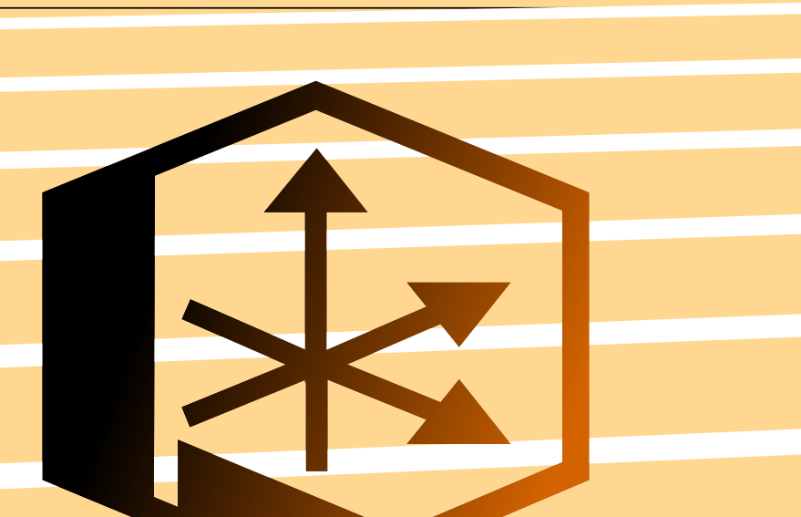
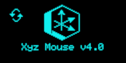
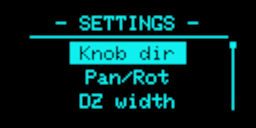
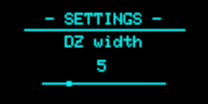



# Xyz Mouse firmware for Orbion

An alternate firmware for [Orbion spacemouse](https://github.com/FaqT0tum/Orbion_3D_Space_Mouse) compatible with 3Dconnexion drivers that mimic Spacemouse compact.

It gives to your Orbion 6Dof (see usage). The current firmware is designed for
Arduino Leonardo. Ports for more modern mcus and different sensors is planned.

## First done : 

- Orbion_Neopixel library
- Rotary encoder library based on https://github.com/mathertel/RotaryEncoder
- Joystick library
- button library
- display Library (still to simplify)

## Todo/improve

- HID feedback

## Installation :

It can be tricky to get the firmware to be recognized by the system. Follow this steps to get it work.
- Clone the current repo,
- Open the folder with platformio in Vscode
- Check ``platformio.ini`` and ``src\settings.h``
- Compile and upload the firmware
- Unplug/plug the Orbion
- Install the [3DConnexion drivers](https://3dconnexion.com/us/drivers/) 
- Restart your computer.

> The default display build is configured for sh110x, if you want change for SSD1306 open platformio.ini and change ``default_envs`` value to  ``ssd1306``

## Usage :
At first run the firmware store a default config in EEPROM

| Mode   | actuators  |  function   | Notes |
|--------|----------|-------------| ---|
| Normal  | B1/B2 | Button Left / Button right |
|   | Joystick or rot knob | Panning / Rotation || 
|   | B3  | Enter settings |
|   | B_Knob + Joystick or rot Knob | Panning / Rotation | 
| Settings | B_Knob | Select |
|   | B3 | Return/Cancel |
|   | rot_Knob | scroll |
| Color settings  | rot_Knob | change Hue | 16M color settings
|   | Joystick X | change saturation |
|   | Joystick Y | change brigthness | Brigthness of Color1 is used in Rainbow mode

##  Settings Menu

Press B3 button to enter menu

Use encoder to navigate, Knob button to enter item or validate, B3 button to cancel.

### Settings

  - **Knob dir.**: _[Left hand, Right hand]_ (default: Left Hand)  
    Change the direction of the encoder.
  - **Rot / Pan**: _[Hold to Pan, Hold to Rot, Click to invert]_ (default: Click to invert)  
    Three modes: `Hold to Pan` (hold knob button to pan), `Hold to Rot` (hold knob button to rotate), `Click to invert` (press knob button to switch between pan and rotate).
  - **DZ Width**: _[3 - 20]_ (default: 5). \
    Joystick deadzone setting
  - **Sensitivity**: _[1 - 5]_ (default: 5).\
    Joystick sensitivity
  - **1st Color**: _For LED effects_ (default: HSV(46,127,127)).
  - **2nd Color**: _Secondary color for LED effects_ (default: HSV(127,127,127)).
  - **Led Motion**: _[Running, Chase, Fixed]_ (default: Chase).

  - **Color Mode**: _[Off, 1st Color, Mixed, Rainbow]_ (default: Mixed)  
    Mixed creates a gradient between Color 1 and Color 2.
  - **OLED Contrast**: _[1 - 5]_ (default: 1). \
    Screen contrast setting _(only for SH110x display, it does nothing on SSD1306)_
  - **Timeout (sec)**: _[3 - 60]_ (default: 30s). \
    Time before screensaver activates
  - **Restore def.**: Reset all settings to default.

All other settings (by app, buttons functions )can be done in 3DxWare on your computer.

## Troubleshooting
_**I cannot access the Settings menu pressing B3:**_

  Check if settings.h follows your pinout. 

_**Black screen at startup, Not recognize as SpaceMouse**_

  Uninstall/reinstall 3Dconnexion drivers. Restart you computer.
  or flash the firmware again.

## Any questions

@fboc on Discord

## Inspiration sources : 
- https://github.com/jfedor2/spaceball-2003
- https://github.com/JakubAndrysek/PySpaceMouse